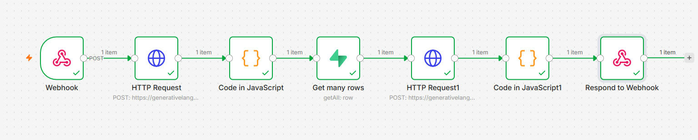
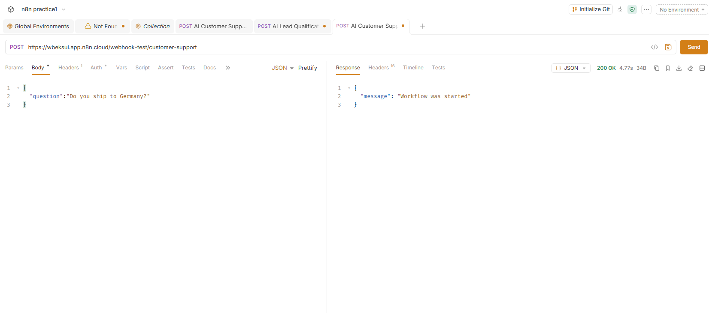
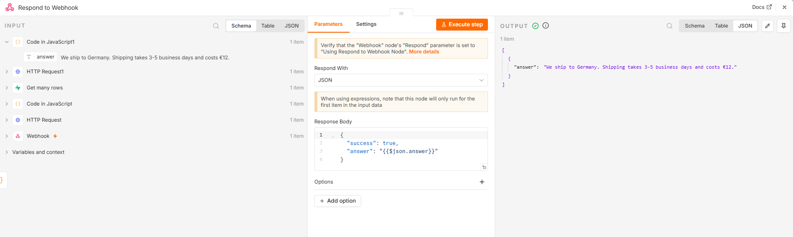

# AI Customer Support Agent (RAG)

## Overview

An AI-powered customer support workflow built with n8n that answers customer questions using a company knowledge base stored in Supabase.

The workflow classifies the customer's question, retrieves the relevant knowledge, and generates an accurate response using Gemini AI.

---

## Features

- AI topic classification
- Knowledge Base stored in Supabase
- Retrieval-Augmented Generation (RAG)
- Gemini 3 Flash API
- Webhook endpoint
- JSON API response

---

## Technologies

- n8n
- Google Gemini API
- Supabase
- JavaScript
- HTTP Request
- Webhooks

---

## Workflow

Customer Question

↓

Gemini (Topic Classification)

↓

Extract Topic

↓

Supabase Search

↓

Gemini (Generate Answer)

↓

Webhook Response

---

## Example Request

```json
{
  "question": "Do you ship to Germany?"
}
```

## Example Response

```json
{
  "success": true,
  "answer": "Yes. We ship to Germany. Delivery takes 3–5 business days and shipping costs €12."
}
```

---

## Skills Demonstrated

- AI Automation
- RAG
- Prompt Engineering
- REST APIs
- Supabase Integration
- AI Workflows
- Knowledge Base Search
- n8n Automation

---
## Workflow



## Test Request



## Test Response



## Supabase Knowledge Base


## Author

Built by Zvc Qds using n8n and Google Gemini.
